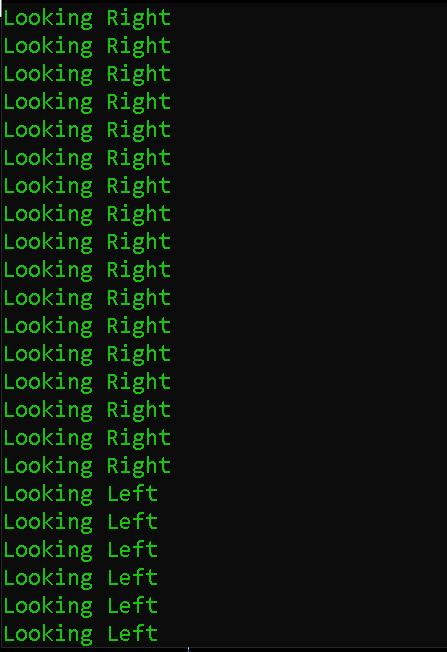

# Eye-Pupil-Tracking-With-Opencv-Python
Test Project for eye pupil tracking using opencv-python

## Description
1. Frame with name "threshold" will show you the result after Threshold(white color is representing pupil)

2. Frame with name "frame" you can see the tracking of eye pupil
3. Area bounded with Red boundry is showing pupil detected after threshold operation
4. Area bounded with Green boundry is showing you the region covered with max height and width
5. Cross point of Vertical and Horizontal Yellow lines representing the center point of detected Pupil

6. In command Prompt you can see where that eye is seeing (Right, Left, Up, Down)

---
## Steps
1. Run eye_test.py 
---
